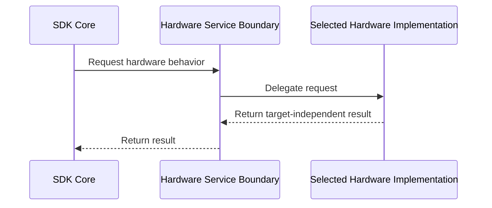

# Hardware Target Selection Architecture

> **Illustrative example — non-normative.**
>
> This file demonstrates the architecture design format. It is not the
> software's accepted architecture and does not serve as product authority.
> Diagram assets are intentionally omitted from this example.

## Scope

- Build-time selection of the SDK hardware-target implementation
- The target-independent boundary between the SDK core and hardware-specific
  behavior

## Design Purpose

Provide one stable hardware-service boundary while allowing each configured
build to contain exactly one target-specific implementation. The architecture
prevents the SDK core from depending directly on a hardware variant.

## Context

- External dependencies:
    - CMake consumes the canonical `SDK_HW_TARGET` value and selects the source
      set for the configured build.
    - The selected hardware platform provides the resources used by its
      target-specific implementation.

## Design

### Component Diagram

Not applicable: this non-normative example omits diagram source and rendered
assets. [Issue #43](https://github.com/myungjinlee-gmail/MJ_works/issues/43)
owns the reusable PlantUML component-diagram template and rendering workflow.

### Dynamic Behavior

#### Component-level Sequence

The selected implementation performs the interaction in the caller's execution
context. The participants show component ordering and do not represent one
thread per component.

#### Data Flow

The SDK core passes abstract hardware requests to Hardware Service Boundary and
receives target-independent results. The boundary passes the request to the
selected implementation. Details below this conceptual flow remain in their
owning downstream design or implementation artifacts.

#### Control Flow

Not applicable: build configuration selects the implementation before runtime,
and runtime requests do not branch between target implementations.

#### State Machine

Not applicable: the selection is immutable for the configured build and this
architecture introduces no component-level state machine.

### Components

#### SDK Core

- Responsibility:
    - Initiate target-independent hardware requests needed by SDK behavior.
    - Remain independent of all concrete hardware-target implementations.
- Input:
    - Application or SDK operation requiring hardware behavior
- Output:
    - Target-independent SDK result
- Relationships:
    - Inherits from:
    - Uses:
        - [swad-component-02](#swad-component-02)
- Traceability:
    - Upstream:
        <!--
        Illustrative exception: this example has no companion SWR for SDK Core.
        Every component in an accepted architecture shall have at least one
        concrete SWR link under Upstream.
        -->
    - Downstream:
    - Configuration:

#### Hardware Service Boundary

- Responsibility:
    - Present target-independent hardware behavior to SDK Core.
    - Delegate each request to the implementation included in the configured
      build.
- Input:
    - Target-independent hardware request
- Output:
    - Target-independent hardware result or error
- Relationships:
    - Inherits from:
    - Uses:
        - [swad-component-03](#swad-component-03)
        - [swad-component-04](#swad-component-04)
        - [swad-component-05](#swad-component-05)
- Traceability:
    - Upstream:
        - [SWR-CFG-001](/docs/design/requirement/software_requirement_example.md)
    - Downstream:
        - [SWCD](/docs/design/component/component_design_example.md)
    - Configuration:

The three `Uses` relationships are mutually exclusive configured alternatives;
they are not simultaneous runtime dependencies.

#### Vanilla Hardware Implementation

- Responsibility:
    - Provide Hardware Service Boundary behavior for `SDK_HW_TARGET=vanilla`.
- Input:
    - Target-independent hardware request
- Output:
    - Target-independent hardware result or error
- Relationships:
    - Inherits from:
    - Uses:
- Traceability:
    - Upstream:
        - [SWR-CFG-001](/docs/design/requirement/software_requirement_example.md)
    - Downstream:
    - Configuration:

#### NVIDIA Hardware Implementation

- Responsibility:
    - Provide Hardware Service Boundary behavior for `SDK_HW_TARGET=nvidia`.
- Input:
    - Target-independent hardware request
- Output:
    - Target-independent hardware result or error
- Relationships:
    - Inherits from:
    - Uses:
- Traceability:
    - Upstream:
        - [SWR-CFG-001](/docs/design/requirement/software_requirement_example.md)
    - Downstream:
    - Configuration:

#### Arm Hardware Implementation

- Responsibility:
    - Provide Hardware Service Boundary behavior for `SDK_HW_TARGET=arm`.
- Input:
    - Target-independent hardware request
- Output:
    - Target-independent hardware result or error
- Relationships:
    - Inherits from:
    - Uses:
- Traceability:
    - Upstream:
        - [SWR-CFG-001](/docs/design/requirement/software_requirement_example.md)
    - Downstream:
    - Configuration:

### Interfaces

Not applicable: this illustrative architecture introduces no external software
interface; Hardware Service Boundary is internal to the SDK.

### Execution Architecture

#### Threads

Hardware requests execute in the caller's conceptual execution context. The
architecture does not assign one thread to each component. Detailed execution
and synchronization decisions belong to their owning downstream design or
implementation artifacts.

#### Pipelines

This design contains no processing pipeline. The section remains so a future
conceptual pipeline can be described here, while buffering, backpressure,
scheduling, and implementation remain in their owning downstream design or
implementation artifacts.

#### Timing Constraints

Not applicable: the linked illustrative requirement defines no timing
constraint.

#### Shared Resources

Each selected hardware implementation owns its target-private resources. The
detailed resource types, handles, lifetime mechanisms, and synchronization
belong to their owning downstream design or implementation artifacts.

#### Hardware/Core Mapping

The vanilla, NVIDIA, and Arm implementations map to their corresponding
configured hardware targets. Core affinity is not specified because the linked
illustrative requirement defines no processor-core allocation.
