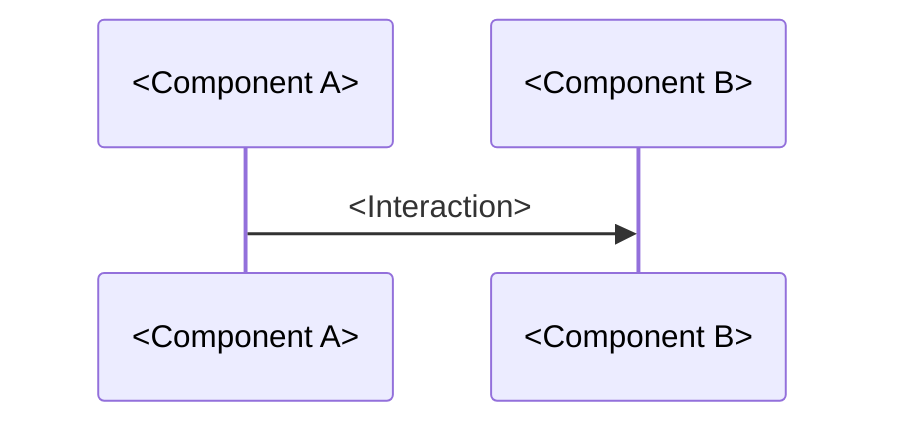

# <Software architecture design title>

<!--
Copy this file to the architecture design document for the software.
Replace every placeholder and remove instructional comments.

Describe software architecture at the component level. Keep content below a
component boundary in its owning downstream design artifacts.
-->

## Scope

- <Architecture scope>

## Design Purpose

<Problem addressed by the architecture and intended architectural outcome>

## Context

<!--
Identify external systems, libraries, services, hardware, and other dependencies
outside the owned architecture. State why each dependency is needed and which
boundary or contract governs the interaction.
-->

- External dependencies:
    - <External dependency and its relationship to the software>

## Design

### Component Diagram

<!--
Show components and architecture-significant relationships. Define relationship
details in each component's `Relationships` list; do not repeat them below the
diagram.
-->

[PlantUML source](<component-diagram.pu-location>)

### Dynamic Behavior

#### Component-level Sequence

<!--
Use sequence diagrams to show ordering between components. Interactions may run
concurrently. A sequence-diagram participant represents an architecture
component, not necessarily one thread, process, task, or other execution unit.
Describe execution allocation separately under Execution Architecture.
-->

#### Data Flow

<!--
Keep this subsection. Describe only the conceptual data movement between
architecture components. Keep lower-level data flow and implementation in
their owning downstream design or implementation artifacts.
-->

<Conceptual data flow and applicable downstream design boundary>

#### Control Flow

<!--
Describe architecture-level triggers, decisions, and response propagation only
when control flow needs clarification. Otherwise write
`Not applicable: <reason>`.
-->

<Control-flow description, or Not applicable: reason>

#### State Machine

<!--
Describe component-level states, transitions, and state-dependent behavior only
when a state machine is needed. Otherwise write `Not applicable: <reason>`.
-->

<State-machine description and diagram, or Not applicable: reason>

### Components

<!--
Repeat the following subsection for every architecture component.

Replace `nn` in `swad-component-nn` with the component's zero-padded two-digit
sequence number. Preserve an accepted component ID when its name or description
changes. Do not reuse or renumber an accepted component ID. In each relationship
link, replace `nn` with the target component's sequence number.

Write one architecture-level responsibility per list item and add as many
items as the component needs.

Describe inputs and outputs abstractly in terms of information, events, or
control. Do not include concrete data types, parameters, messages, or function
signatures.

Record inherited components and directly used components only when the
relationship affects an architecture responsibility, boundary, data or control
flow, ownership, lifetime, substitutability, or failure propagation. Exclude a
globally available component when all of these are true:

- it provides cross-cutting infrastructure uniformly to unrelated components;
- its use does not change the using component's architecture responsibility or
  boundary; and
- omitting the relationship does not hide required data flow, control flow,
  ownership, lifetime, failure propagation, or requirement allocation.

Logging, diagnostics, and generic utility components commonly meet this
exclusion rule. Include them when any criterion is not satisfied.

Do not identify constituent units or their detailed design. Content below the
component boundary belongs to its owning downstream design artifacts.

Every accepted component links at least one accepted SWR under `Upstream`, and
each SWR provides the reverse component link.

An SWCD has no separate design ID. Link its file directly from `Downstream`.
The link label is descriptive and need not match the SWCD title. The SWCD links
back to this component with the stable `swad-component-nn` ID. Add or update
both links in the same Pull Request.
-->

#### <Component name>

- Responsibility:
    - <Architecture-level responsibility>
    - <Additional architecture-level responsibility>
- Input:
    - <Abstract input information, event, or control>
- Output:
    - <Abstract output information, event, or control>
- Relationships:
    - Inherits from:
        - [swad-component-nn](#swad-component-nn)
    - Uses:
        - [swad-component-nn](#swad-component-nn)
- Traceability:
    - Upstream:
        - [<SWR-ID>](/docs/design/requirement/SWR-DOMAIN-NNN/SWR-DOMAIN-NNN-title.md)
    - Downstream:
        - [SWCD](/src/component-name/component-name.md)
    - Configuration:
        - [<CONFIGURATION-SPEC-ID>](/PATH/TO/CONFIGURATION-SPEC.md)

### Interfaces

<!--
Keep this section. Briefly describe each external interface's conceptual
purpose and architecture boundary. Keep detailed operations, data definitions,
protocols, error behavior, timing, compatibility, and implementation in their
owning downstream design or external interface specification. When no external
interface exists, write `Not applicable: <reason>`.
-->

<Conceptual external-interface summary, or Not applicable: reason>

<How and when the details transfer to the external interface specifications>

- External interface specifications:
    - [<INTERFACE-SPEC-ID>](/PATH/TO/INTERFACE-SPEC.md)

### Execution Architecture

#### Threads

<!--
Keep this subsection. Describe only the conceptual execution contexts,
concurrency needs, and their relationship to architecture components. Keep
detailed thread ownership, scheduling, synchronization, lifecycle, and
implementation in their owning downstream design or implementation artifacts.
-->

<Conceptual thread model and applicable downstream design boundary>

#### Pipelines

<!--
Keep this subsection. Describe only the conceptual processing stages, ordering,
and concurrency between stages. Keep detailed collaboration, pipeline
ownership, buffering, backpressure, scheduling, and implementation in their
owning downstream design or implementation artifacts.
-->

<Conceptual pipeline model and applicable downstream design boundary>

#### Timing Constraints

<!-- Describe architecture-level timing constraints when applicable. -->

<Timing constraint, or Not applicable: reason>

#### Shared Resources

<!--
Describe shared resource ownership and architecture-level access or
synchronization constraints when applicable.
-->

<Shared resource and ownership model, or Not applicable: reason>

#### Hardware/Core Mapping

<!--
Describe allocation to hardware devices or processor cores when applicable.
-->

<Hardware or core allocation, or Not applicable: reason>
