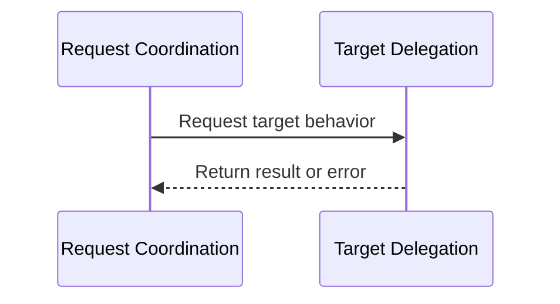

# Hardware Service Boundary Component Design

> **Illustrative example — non-normative.**
>
> This control document demonstrates the SWCD format. It is not an accepted
> component design and does not serve as product authority.

## Scope

- Target:
    - Hardware Service Boundary
- Design level:
    - Implementation-neutral decomposition into abstract constituent units
- Included scope:
    - Internal request coordination and target delegation
    - Direct usage and significant ordering between constituent units
    - Component-level configuration effects
- Excluded scope:
    - Architecture-level component responsibilities and relationships
    - Detailed unit design, cross-component unit usage, and implementation
      decisions

## Traceability

- Upstream:
    - [swad-component-02](/docs/design/architecture/architecture_design_example.md#swad-component-02)

## Design Method

- Separate component-facing request coordination from target delegation.
- Keep target selection authoritative in the owning architecture.
- Propagate results and errors through the same internal collaboration path as
  the request.

## Design

### Component Diagram

Not applicable: this non-normative example omits diagram source and rendered
assets. Authored SWCDs follow the PlantUML source-and-render workflow defined
by the component design skeleton and rule.

### Dynamic Behavior

#### Unit-level Sequence

The result or error follows the same collaboration path back to the component
boundary. The interaction runs in the requesting execution context, so this
design introduces no independent concurrency requirement.

### Units

#### Request Coordination

- Responsibility:
    - Coordinate the component-facing request and propagate its outcome.
- Input:
    - Target-independent hardware-behavior request
- Output:
    - Target-independent hardware-behavior result or error
- Relationships:
    - Uses:
        - [swcd-unit-02](#swcd-unit-02)
- Traceability:
    - Downstream:

#### Target Delegation

- Responsibility:
    - Obtain target behavior through the collaboration selected by the owning
      architecture.
- Input:
    - Target-independent hardware-behavior request
- Output:
    - Target-independent hardware-behavior result or error
- Relationships:
    - Uses:
- Traceability:
    - Downstream:

### Configuration Effects

The constituent-unit set and responsibilities remain unchanged across target
configurations. The owning architecture determines which target behavior is
available to Target Delegation. This SWCD adds no configuration relationship
or value beyond that architecture decision.
