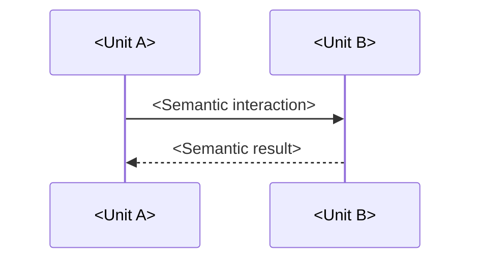

# <Component name> Component Design

<!--
Copy this control skeleton alongside the owning component and name it after
that component's directory. Replace every placeholder and remove instructional
comments.

Describe the component as an implementation-neutral composition of abstract
units. Keep detailed unit-design and implementation decisions in their owning
artifacts.
-->

## Scope

- Target:
    - <Design target covered by this document>
- Design level:
    - <Level of design detail covered by this document>
- Included scope:
    - <Primary design concern owned by this document>
<!-- Omit Excluded scope when no meaningful exclusion exists. -->
- Excluded scope:
    - <Design concern explicitly outside this document>

## Traceability

- Upstream:
    - [swad-component-nn](/PATH/TO/ARCHITECTURE-DOCUMENT.md#swad-component-nn)

## Design Method

<!--
List the design methods and rules that apply throughout this component.
-->

- <Component-wide design method or rule>
- <Additional component-wide design method or rule>

## Design

### Component Diagram

<!--
Show constituent units and their direct interactions. Author the diagram as
PlantUML source and commit its rendered SVG with the source.
-->

[PlantUML source](<component-diagram.pu-location>)

### Dynamic Behavior

#### Unit-level Sequence

<!--
Optional. Omit this subsection when there is no connection between constituent
units in this component. When an internal `Uses` relationship exists, show the
significant ordering across the connected units.
-->

### Units

<!--
Repeat this entry for every constituent unit.

Record only `Uses` relationships between units owned by this component. Define
usage relationships to units owned by another component in the owning unit's
Software Detailed Design (SWDD).
-->

#### <Unit name>

- Responsibility:
    - <Abstract unit responsibility>
- Input:
    - <Semantic input>
- Output:
    - <Semantic output>
- Relationships:
    - Uses:
        - [swcd-unit-nn](#swcd-unit-nn)
- Traceability:
    - Downstream:

### Configuration Effects

<How configuration affects the component and its unit composition without
duplicating authoritative architecture relationships>
